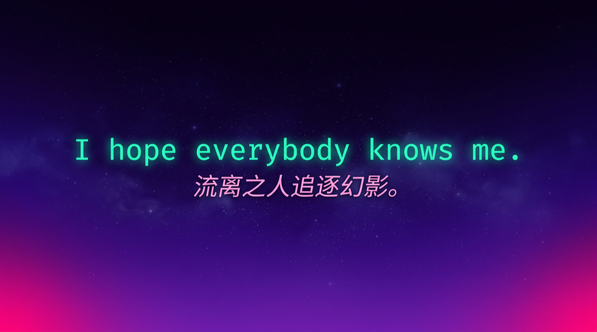

<!-- ============================================================
   Dest1ny-Sec · v2.5
   Tone: 流离之人追逐幻影
   Fix: 加回 banner · 砍掉 building 表格 · 贪吃蛇紧贴 163 contributions
   ============================================================ -->

<!-- Intro hero: AI 跑的银河紫背景 + 荧光色文字 -->

 

---

<!-- 贪吃蛇：紧贴 profile 顶部的 163 contributions 区域，无独立小标题 -->
<picture>
  <source media="(prefers-color-scheme: dark)" srcset="https://raw.githubusercontent.com/Dest1ny-Sec/Dest1ny-Sec/output/github-snake-dark.svg" />
  <source media="(prefers-color-scheme: light)" srcset="https://raw.githubusercontent.com/Dest1ny-Sec/Dest1ny-Sec/output/github-snake.svg" />
  
</picture>

 

---

<b>building</b> · <a href="https://github.com/Dest1ny-Sec/DesJsFinder">DesJsFinder</a> · <a href="https://github.com/Dest1ny-Sec/Des-CTF-Knowledge">Des-CTF-Knowledge</a> · <a href="https://github.com/Dest1ny-Sec/Luvv-MCP">Luvv-MCP</a> · <a href="https://github.com/Dest1ny-Sec/dhunter">dhunter</a>
 
<b>stacks</b> · Python · JavaScript · Go · Docker · Linux · Claude

 

---

  
  
  
    
  

